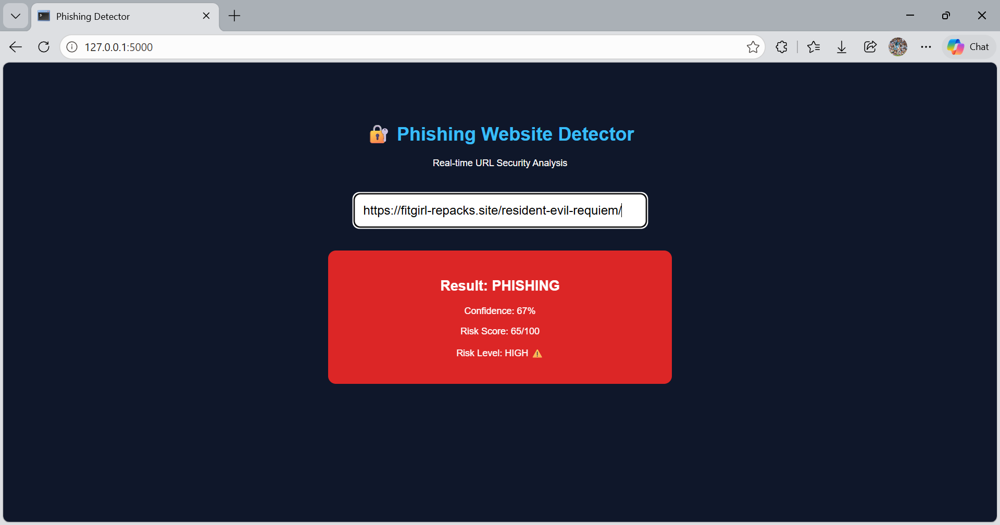
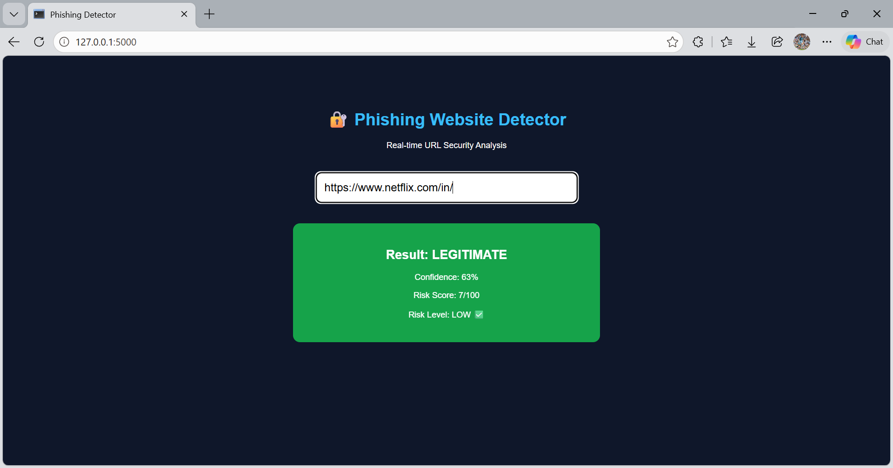

# Phishing Website Detector (Live Detection System)

A machine learning-based web application that detects phishing websites using URL analysis and instant prediction through a live interactive web interface.

---

## Features

- Live URL detection (instant response while typing)
- Machine Learning model (Random Forest)
- URL feature extraction (6 features)
- Risk scoring system (0–100)
- Trusted domain detection
- Interactive UI (Flask + JavaScript)

---

## How It Works

1. User enters a URL in the web interface
2. System extracts features:
   - URL length
   - Special characters
   - IP address presence
   - Number of dots
   - HTTPS usage
   - Suspicious keywords
3. Machine Learning model predicts:
   - Phishing or Legitimate
4. Risk score is calculated
5. Results are displayed instantly to the user

---

## Tech Stack

- Python
- Flask
- Scikit-learn
- HTML, CSS, JavaScript

---

## Example Output

- Result: PHISHING
- Confidence: 85%
- Risk Score: 72/100
- Risk Level: HIGH ⚠️

### Detection Result

---

## Disclaimer

This project is a prototype built for educational purposes and demonstrates phishing detection using machine learning. It is not a production-level security system.

---

## Author

Your Name
